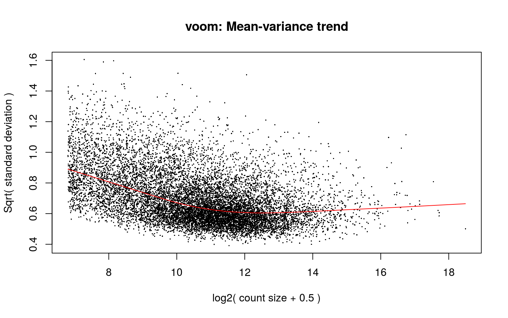
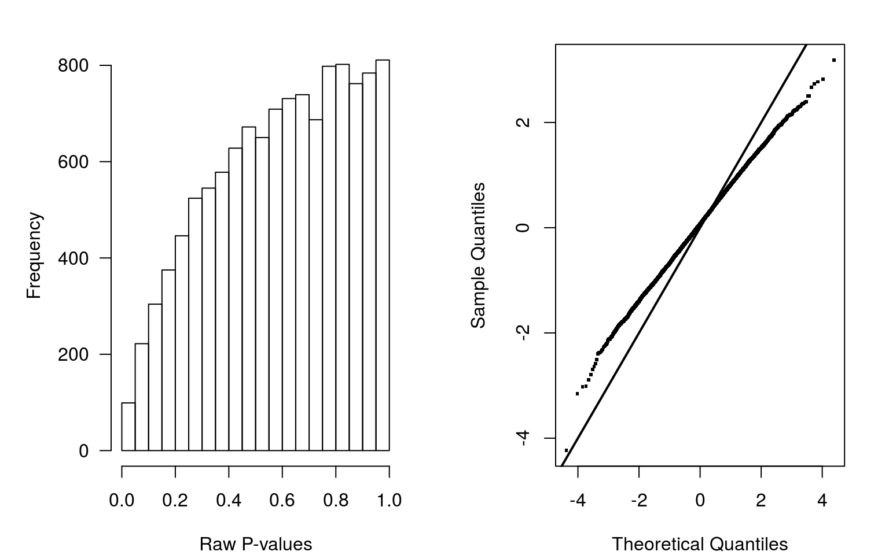

---
output:
  BiocStyle::html_document
---


# Surrogate Variable Analysis
We perform differentual expression analysis using limma pipeline, combined with the surrogate variable analysis using the R/Bioconductor package [sva](http://bioconductor.org/packages/sva).


First, we do the SVA to adjust for surrogated variables. In the design matrix is also included the patient identifications. 


```r
library(sva)

mod <- model.matrix(~type + bcr_patient_barcode, data = colData(se.filt))
mod0 <- model.matrix(~1, data = colData(se.filt))


sv <- sva(assays(se.filt)$logCPM, mod = mod, mod0 = mod0)
```

```
Number of significant surrogate variables is:  11 
Iteration (out of 5 ):1  2  3  4  5  
```

```r
sv$n
```

```
[1] 11
```
There are 11 surrogate variables. We combine the model matrix with the surrogate variables.


```r
mod <- cbind(mod, sv$sv)
colnames(mod) <- c(colnames(mod)[1:(nlevels(se.filt$bcr_patient_barcode)+1)], paste0("SV", 1:sv$n))
```

# Differential expression analysis with limma-voom

Now we perform limma-voom method to adjust for mean-variance relationship. We use lmFit function to calculate the linear model and eBayes function to calculate the moderated t-statistic. Finally, decideTests function will classify into upregulated, downregulated or non-significant.


```r
v <- voom(dge.filt, mod, plot=TRUE)
```

<div class="figure" style="text-align: center">

<p class="caption">(\#fig:voom)Voom plot</p>
</div>

```r
fit <- lmFit(v, mod)
fit <- eBayes(fit)

FDRcutoff <- 0.1
res <- decideTests(fit, p.value = FDRcutoff)
summary(res)
```

```
       (Intercept) typetumor bcr_patient_barcodeTCGA-22-4609
Down             2         0                               4
NotSig         473     11866                           11861
Up           11391         0                               1
       bcr_patient_barcodeTCGA-22-5471 bcr_patient_barcodeTCGA-22-5472
Down                                 2                               1
NotSig                           11862                           11863
Up                                   2                               2
       bcr_patient_barcodeTCGA-22-5478 bcr_patient_barcodeTCGA-22-5481
Down                                 0                               6
NotSig                           11865                           11858
Up                                   1                               2
       bcr_patient_barcodeTCGA-22-5482 bcr_patient_barcodeTCGA-22-5483
Down                                11                               2
NotSig                           11852                           11863
Up                                   3                               1
       bcr_patient_barcodeTCGA-22-5489 bcr_patient_barcodeTCGA-22-5491
Down                                 3                               4
NotSig                           11860                           11860
Up                                   3                               2
       bcr_patient_barcodeTCGA-33-4587 bcr_patient_barcodeTCGA-33-6737
Down                                 6                               5
NotSig                           11859                           11858
Up                                   1                               3
       bcr_patient_barcodeTCGA-34-7107 bcr_patient_barcodeTCGA-34-8454
Down                                 1                              18
NotSig                           11864                           11836
Up                                   1                              12
       bcr_patient_barcodeTCGA-39-5040 bcr_patient_barcodeTCGA-43-3394
Down                                 4                               5
NotSig                           11860                           11856
Up                                   2                               5
       bcr_patient_barcodeTCGA-43-5670 bcr_patient_barcodeTCGA-43-6143
Down                                 1                               2
NotSig                           11863                           11862
Up                                   2                               2
       bcr_patient_barcodeTCGA-43-6647 bcr_patient_barcodeTCGA-43-6771
Down                                 9                               4
NotSig                           11855                           11860
Up                                   2                               2
       bcr_patient_barcodeTCGA-43-6773 bcr_patient_barcodeTCGA-43-7657
Down                                 8                              13
NotSig                           11832                           11848
Up                                  26                               5
       bcr_patient_barcodeTCGA-43-7658 bcr_patient_barcodeTCGA-51-4079
Down                                 8                              22
NotSig                           11857                           11834
Up                                   1                              10
       bcr_patient_barcodeTCGA-51-4080 bcr_patient_barcodeTCGA-51-4081
Down                                 2                               3
NotSig                           11862                           11861
Up                                   2                               2
       bcr_patient_barcodeTCGA-56-7222 bcr_patient_barcodeTCGA-56-7579
Down                                 2                               3
NotSig                           11855                           11860
Up                                   9                               3
       bcr_patient_barcodeTCGA-56-7580 bcr_patient_barcodeTCGA-56-7582
Down                                20                               9
NotSig                           11810                           11839
Up                                  36                              18
       bcr_patient_barcodeTCGA-56-7730 bcr_patient_barcodeTCGA-56-7731
Down                                 1                               7
NotSig                           11862                           11856
Up                                   3                               3
       bcr_patient_barcodeTCGA-56-8309 bcr_patient_barcodeTCGA-56-8623
Down                                 2                               4
NotSig                           11858                           11861
Up                                   6                               1
       bcr_patient_barcodeTCGA-58-8386 bcr_patient_barcodeTCGA-60-2709
Down                                 1                               3
NotSig                           11864                           11861
Up                                   1                               2
       bcr_patient_barcodeTCGA-77-7138 bcr_patient_barcodeTCGA-77-7142
Down                                 5                              17
NotSig                           11858                           11843
Up                                   3                               6
       bcr_patient_barcodeTCGA-77-7335 bcr_patient_barcodeTCGA-77-7337
Down                                 9                               1
NotSig                           11852                           11862
Up                                   5                               3
       bcr_patient_barcodeTCGA-77-7338 bcr_patient_barcodeTCGA-77-8007
Down                                 5                               9
NotSig                           11857                           11856
Up                                   4                               1
       bcr_patient_barcodeTCGA-77-8008 bcr_patient_barcodeTCGA-85-7710
Down                                28                              88
NotSig                           11825                           11671
Up                                  13                             107
       bcr_patient_barcodeTCGA-90-6837 bcr_patient_barcodeTCGA-90-7767
Down                                 7                              13
NotSig                           11852                           11846
Up                                   7                               7
       bcr_patient_barcodeTCGA-92-7340   SV1   SV2   SV3   SV4   SV5   SV6
Down                                13  1606  2150  2551  1744  1900  1184
NotSig                           11847  8219  7875  7238  8646  8313  9463
Up                                   6  2041  1841  2077  1476  1653  1219
         SV7   SV8   SV9  SV10  SV11
Down     747   648   895   303   384
NotSig 10396 10482 10209 11399 11300
Up       723   736   762   164   182
```

There is no differentially expressed gene. All genes are non-significant for the _type_ variable, which is our variable of interest.

We can build a table to classify and sort the genes by p-value.


```r
genesmd <- data.frame(chr = as.character(seqnames(rowRanges(se.filt))), symbol = rowData(se.filt)[, 1], stringsAsFactors = FALSE)

fit$genes <- genesmd

tt <- topTable(fit, coef = 2, n = Inf)
head(tt, n = 10)
```

```
         chr    symbol      logFC  AveExpr         t      P.Value adj.P.Val
3737    chr1     KCNA2  1.6261737 7.016262  2.772653 0.0084270730 0.9997256
6670    chr2       SP3 -2.2126834 6.867519 -2.642088 0.0117319514 0.9997256
7334   chr12     UBE2N -4.0600224 2.192373 -4.235944 0.0001311969 0.9997256
56999   chr3   ADAMTS9 -2.5188837 4.158329 -3.013702 0.0044805536 0.9997256
23409  chr12     SIRT4 -0.7626027 5.447291 -2.400657 0.0211469578 0.9997256
54465   chr2     ETAA1  0.9422784 6.564915  2.386613 0.0218635472 0.9997256
339967  chr4 TMPRSS11A  3.5046682 6.821845  2.505872 0.0164193440 0.9997256
5782    chr7    PTPN12  1.3602872 8.734349  2.342342 0.0242683012 0.9997256
2219    chr9      FCN1  1.6653676 5.230000  2.669790 0.0109441892 0.9997256
80335   chr3     WDR82  1.0508389 5.966129  2.363655 0.0230823491 0.9997256
               B
3737   -4.405096
6670   -4.420213
7334   -4.441569
56999  -4.442297
23409  -4.451648
54465  -4.453891
339967 -4.454001
5782   -4.456015
2219   -4.461125
80335  -4.462878
```

As we can see in the table, the adjusted p-values are close to 1. For this reason, they are far from being significant.

## Raw p-values distribution

Under the null-hypothesis, the distribution of raw p-values must be uniform. We plot a histogram with the p-values and a QQ-plot (Figure \@ref(fig:pvalues)). 

Both plots show that the disribution is far from being uniform. This may be because some variability not explained neither by the biological factor nor by the surrogate variables. More quality assessments could be done in order to correct for this biases.

<div class="figure" style="text-align: center">

<p class="caption">(\#fig:pvalues)p-values and QQ-plot.</p>
</div>
