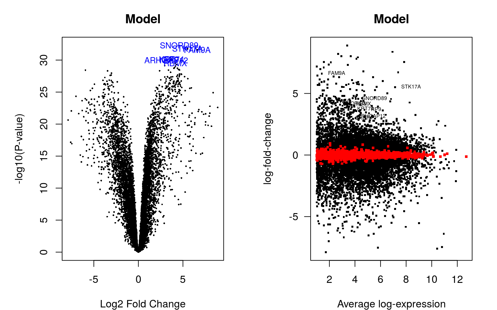
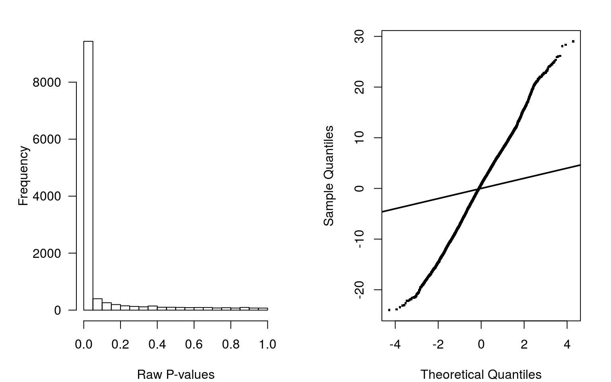

---
output:
  BiocStyle::html_document
---


# Differential expression analysis with limma-voom

In this cas there is no surogate variables analysis. Limma-voom method is performed to adjust for mean-variance relationship. We use lmFit function to calculate the linear model and eBayes function to calculate the moderated t-statistic. Finally, decideTests function will classify into upregulated, downregulated or non-significant.
<div class="figure" style="text-align: center">

<p class="caption">(\#fig:voom2, )Voom plot</p>
</div>

```
       (Intercept) typetumor bcr_patient_barcodeTCGA-22-4609
Down            19      4402                               0
NotSig         550      2147                           11865
Up           11297      5317                               1
       bcr_patient_barcodeTCGA-22-5471 bcr_patient_barcodeTCGA-22-5472
Down                                 1                               1
NotSig                           11860                           11863
Up                                   5                               2
       bcr_patient_barcodeTCGA-22-5478 bcr_patient_barcodeTCGA-22-5481
Down                                 1                               8
NotSig                           11864                           11854
Up                                   1                               4
       bcr_patient_barcodeTCGA-22-5482 bcr_patient_barcodeTCGA-22-5483
Down                                 1                               1
NotSig                           11864                           11864
Up                                   1                               1
       bcr_patient_barcodeTCGA-22-5489 bcr_patient_barcodeTCGA-22-5491
Down                                 0                               1
NotSig                           11866                           11863
Up                                   0                               2
       bcr_patient_barcodeTCGA-33-4587 bcr_patient_barcodeTCGA-33-6737
Down                                49                               2
NotSig                           11727                           11859
Up                                  90                               5
       bcr_patient_barcodeTCGA-34-7107 bcr_patient_barcodeTCGA-34-8454
Down                                 0                              10
NotSig                           11865                           11853
Up                                   1                               3
       bcr_patient_barcodeTCGA-39-5040 bcr_patient_barcodeTCGA-43-3394
Down                                38                               1
NotSig                           11757                           11863
Up                                  71                               2
       bcr_patient_barcodeTCGA-43-5670 bcr_patient_barcodeTCGA-43-6143
Down                                 3                               0
NotSig                           11859                           11865
Up                                   4                               1
       bcr_patient_barcodeTCGA-43-6647 bcr_patient_barcodeTCGA-43-6771
Down                                 6                               0
NotSig                           11859                           11864
Up                                   1                               2
       bcr_patient_barcodeTCGA-43-6773 bcr_patient_barcodeTCGA-43-7657
Down                                 4                              10
NotSig                           11851                           11851
Up                                  11                               5
       bcr_patient_barcodeTCGA-43-7658 bcr_patient_barcodeTCGA-51-4079
Down                                53                               5
NotSig                           11736                           11858
Up                                  77                               3
       bcr_patient_barcodeTCGA-51-4080 bcr_patient_barcodeTCGA-51-4081
Down                                 1                               3
NotSig                           11864                           11853
Up                                   1                              10
       bcr_patient_barcodeTCGA-56-7222 bcr_patient_barcodeTCGA-56-7579
Down                                 1                               0
NotSig                           11859                           11863
Up                                   6                               3
       bcr_patient_barcodeTCGA-56-7580 bcr_patient_barcodeTCGA-56-7582
Down                                 3                               3
NotSig                           11862                           11860
Up                                   1                               3
       bcr_patient_barcodeTCGA-56-7730 bcr_patient_barcodeTCGA-56-7731
Down                                24                               7
NotSig                           11817                           11856
Up                                  25                               3
       bcr_patient_barcodeTCGA-56-8309 bcr_patient_barcodeTCGA-56-8623
Down                                 4                             349
NotSig                           11853                           11191
Up                                   9                             326
       bcr_patient_barcodeTCGA-58-8386 bcr_patient_barcodeTCGA-60-2709
Down                                 0                               1
NotSig                           11864                           11864
Up                                   2                               1
       bcr_patient_barcodeTCGA-77-7138 bcr_patient_barcodeTCGA-77-7142
Down                                 7                             126
NotSig                           11857                           11701
Up                                   2                              39
       bcr_patient_barcodeTCGA-77-7335 bcr_patient_barcodeTCGA-77-7337
Down                                74                               7
NotSig                           11756                           11854
Up                                  36                               5
       bcr_patient_barcodeTCGA-77-7338 bcr_patient_barcodeTCGA-77-8007
Down                                 2                               5
NotSig                           11861                           11860
Up                                   3                               1
       bcr_patient_barcodeTCGA-77-8008 bcr_patient_barcodeTCGA-85-7710
Down                                 6                              30
NotSig                           11858                           11787
Up                                   2                              49
       bcr_patient_barcodeTCGA-90-6837 bcr_patient_barcodeTCGA-90-7767
Down                                 0                               7
NotSig                           11866                           11858
Up                                   0                               1
       bcr_patient_barcodeTCGA-92-7340
Down                                10
NotSig                           11850
Up                                   6
```

Table of results:

```r
genesmd <- data.frame(chr = as.character(seqnames(rowRanges(se.filt))), symbol = rowData(se.filt)[, 1], stringsAsFactors = FALSE)
fit$genes <- genesmd
tt <- topTable(fit, coef = 2, n = Inf)
head(tt, n = 10)
```

```
         chr   symbol    logFC  AveExpr        t      P.Value    adj.P.Val
692205  chr2  SNORD89 4.558016 4.061933 29.03018 5.211431e-33 6.183884e-29
9263    chr7   STK17A 5.510503 7.131354 28.35326 1.590799e-32 9.438213e-29
171482  chrX    FAM9A 6.615355 1.406490 28.08485 2.492491e-32 9.858632e-29
121391 chr12    KRT74 3.723965 3.686091 26.15339 7.085033e-31 2.019640e-27
6100    chr7      RP9 3.665029 4.745683 26.05106 8.510198e-31 2.019640e-27
94134  chr10 ARHGAP12 3.110953 3.727910 25.90667 1.103364e-30 2.182085e-27
27316   chrX     RBMX 4.123045 3.581820 25.37018 2.927936e-30 4.963270e-27
81556  chr15     VWA9 4.322738 2.008536 25.09129 4.897154e-30 7.263703e-27
10523  chr19    CHERP 2.953520 3.510743 24.88294 7.214682e-30 9.512158e-27
93129  chr16    ORAI3 4.155809 3.147168 24.79035 8.577857e-30 1.017848e-26
              B
692205 65.01160
9263   64.02774
171482 63.31797
121391 60.18915
6100   60.05726
94134  59.76904
27316  58.77257
81556  58.16998
10523  57.90230
93129  57.68415
```
As can be seen looking at the p-values, there are significant differential expressed genes. 


DE genes:

```r
DEgenes <- rownames(tt)[tt$adj.P.Val < FDRcutoff]
length(DEgenes)
```

```
[1] 9719
```

```r
saveRDS(DEgenes, file.path("results", "DEgenes.rds"))
```
There are 9719. 

##MA plot with the top 10

<div class="figure" style="text-align: center">

<p class="caption">(\#fig:MAplotNoSVA)Top 10 MA plot</p>
</div>
In the volcano plot, Figure \@ref(fig:MAplotNoSVA), is seen the top 10 genes, all of them with a large magnitude fold-change and high statistical significance. 

##Plot p-values

Both plots in Figure \@ref(fig:pvaluesNoSVA) show that the disribution is far from being uniform. This may be because some variability not explained by the biological factor. Moreover, surrogate variables are not analysed in this case. More quality assessments could be done in order to correct for this biases.

<div class="figure" style="text-align: center">

<p class="caption">(\#fig:pvaluesNoSVA)p-values</p>
</div>


