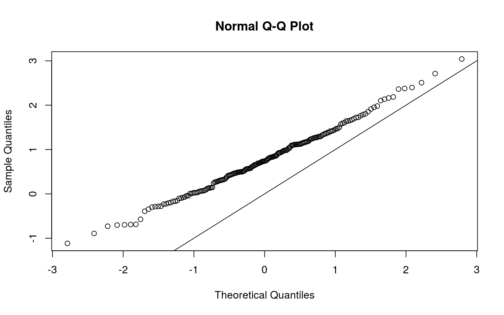
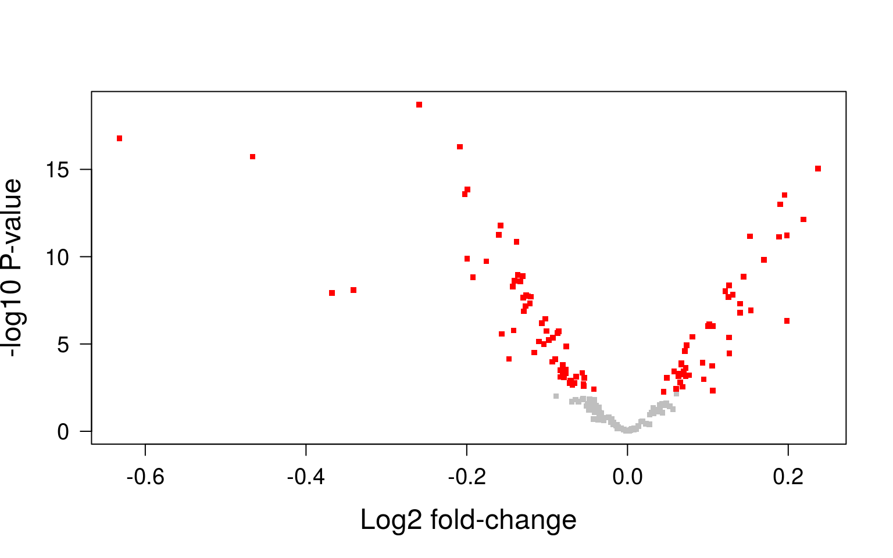

---
output:
  BiocStyle::html_document
---


# Classical functional annotation

As there is no differentially expressed gene, we cannot do any classical functional enrichment, since it is necessary to have a list of differentially expressed genes.

# Gene Set Enrichmen analysis (GSEA)


```r
geneUniverse <- rownames(se.filt)
length(geneUniverse)
```

```
[1] 11866
```

In this case a method for pathway analysis that addresses this shortcoming by assessing differential expression directly at gene set level is used. Therfore, small but consistent changes occurring for a number of genes operating in a common pathway will be found. To perform this it is calculated for each gene set an enrichment score (ES) as function of the changes in gene expression by the genes forming the gene set.

The used gene set collection has been downloaded from GSEA. It is configured of gene sets that represent signatures of cellular pathways which are often disregulated in cancer.


```
GeneSetCollection
  names: GLI1_UP.V1_DN, GLI1_UP.V1_UP, ..., LEF1_UP.V1_UP (189 total)
  unique identifiers: 22818, 143384, ..., 79649 (11250 total)
  types in collection:
    geneIdType: EntrezIdentifier (1 total)
    collectionType: NullCollection (1 total)
```

```
[1] 189
```

```
[1] "GLI1_UP.V1_DN" "GLI1_UP.V1_UP" "E2F1_UP.V1_DN" "E2F1_UP.V1_UP"
[5] "EGFR_UP.V1_DN" "EGFR_UP.V1_UP"
```

There are 189 gene sets in this gene sets collection.

First we map the identifiers from the gene sets to the identifiers of the data we are going to analyze.


```r
gsc <- mapIdentifiers(entrezOncogens, AnnoOrEntrezIdentifier(metadata(se.filt)$annotation))
gsc
```

```
GeneSetCollection
  names: GLI1_UP.V1_DN, GLI1_UP.V1_UP, ..., LEF1_UP.V1_UP (189 total)
  unique identifiers: 22818, 143384, ..., 79649 (11250 total)
  types in collection:
    geneIdType: EntrezIdentifier (1 total)
    collectionType: NullCollection (1 total)
```

in this case, nothing has happend, we could jump this step because data is already anchorated to Entrez identifiers. Now, we start with an incidence matrix indicating what genes belong to what gene set.


```r
Im <- incidence(gsc)
dim(Im)
```

```
[1]   189 11250
```

```r
Im[1:2, 1:10]
```

```
              22818 143384 140711 57583 81669 54432 79712 23596 91543 6580
GLI1_UP.V1_DN     1      1      1     1     1     1     1     1     1    1
GLI1_UP.V1_UP     0      0      0     0     0     0     0     0     0    0
```

The incidence matrix is a matrix in which the rows represent the gene sets, the columns represent the gene in entrez identifier, and the data is 1 or 0, depending whether the gene is in the gene set or it is not.

Next, we discard genes (columns in the incidence matrix) that do not form part of our data.


```r
Im <- Im[, colnames(Im) %in% rownames(se.filt)]
dim(Im)
```

```
[1]  189 6067
```

From 11250 of the genes in the gene sets, only 6067 are in our experiment. The rest may have been filtered during the quality assessment process.

As not all the genes in our experiment are present in the gene sets, we discard them.


```r
se.filt <- se.filt[colnames(Im), ]
dim(se.filt)
```

```
[1] 6067   94
```

```r
dge.filt <- dge.filt[colnames(Im), ]
dim(dge.filt)
```

```
[1] 6067   94
```

Now we perform limma pipeline combined with SVA to create a table of genes and their t-statistic to do the GSEA. The pipeline is the same as in differential expression analysis, but now with less genes (we have filtered them)


```r
library(limma)
library(sva)
mod <- model.matrix(~se.filt$type + bcr_patient_barcode, data = colData(se.filt))
mod0 <- model.matrix(~1, data = colData(se.filt))
sv <- sva(assays(se.filt)$logCPM, mod = mod, mod0 = mod0)
```

```
Number of significant surrogate variables is:  11 
Iteration (out of 5 ):1  2  3  4  5  
```

```r
mod <- cbind(mod, sv$sv)
colnames(mod) <- c(colnames(mod)[1:48], paste0("SV", 1:sv$n))
v <- voom(dge.filt, mod)
fit <- lmFit(assays(se.filt)$logCPM, mod)
fit <- eBayes(fit, trend = TRUE)
tt <- topTable(fit, coef = 2, n = Inf)
```

Now we can calculate the z-score, that gives us more robustness about analyzing the moderated t-statistic. We select only those gene sets with more than 5 genes and sort the z-score to see the most significant gene sets.


```r
Im <- Im[rowSums(Im) >= 5, ]
dim(Im)
```

```
[1]  189 6067
```

```r
tGSgenes <- tt[match(colnames(Im), rownames(tt)), "t"]
length(tGSgenes)
```

```
[1] 6067
```

```r
head(tGSgenes)
```

```
[1] -0.1480484 -0.6165308 -0.3180018  0.9846855 -1.3489488  0.2229815
```

```r
zS <- sqrt(rowSums(Im)) * (as.vector(Im %*% tGSgenes)/rowSums(Im))
length(zS)
```

```
[1] 189
```

```r
head(zS)
```

```
GLI1_UP.V1_DN GLI1_UP.V1_UP E2F1_UP.V1_DN E2F1_UP.V1_UP EGFR_UP.V1_DN 
    0.0813339     0.5123863     1.7608323     0.7978159     2.3626425 
EGFR_UP.V1_UP 
    1.1886709 
```

```r
rnkGS <- sort(abs(zS), decreasing = TRUE)
head(rnkGS)
```

```
         ERB2_UP.V1_DN           MEK_UP.V1_DN CAHOY_OLIGODENDROCUTIC 
              3.040329               2.712168               2.507218 
          WNT_UP.V1_DN      KRAS.600_UP.V1_UP          EGFR_UP.V1_DN 
              2.397208               2.376572               2.362642 
```

## QQ plot

A QQ plot (Figure \@ref(fig:qqplotSVA)) may show visually how the z-scores are distributed.

<div class="figure" style="text-align: center">

<p class="caption">(\#fig:qqplotSVA)QQ-plot.</p>
</div>

This QQ plot shows that the z-scores do not follow a normal distribution. Under the null hypothesis, those z-scores representing gene sets that are not enriched follow a normal distribution, but this does not happens. Maybe because overlapping gene sets or because as this gene set is specific for cancer and we are analyzing cancer cells, the pathways are all significant.

Let's adjust for the p-value to fins differential expressed gene sets.


```r
pv <- pmin(pnorm(zS), 1 - pnorm(zS))
pvadj <- p.adjust(pv, method = "fdr")
DEgs <- names(pvadj)[which(pvadj < 0.01)]
length(DEgs)
```

```
[1] 0
```

There is no gene set enriched.


# Gene Set Variation Analysis (GSVA)

GSVA is another way to analyze the gene sets without a list of differentially expressed genes. This has some properties that can be useful when differential expression analysis and GSEA do not work.


```r
library(GSVA)
GSexpr <- gsva(assays(se.filt)$logCPM, gsc, min.sz=5, max.sz=300, verbose=FALSE)
dim(GSexpr)
```

```
[1] 189  94
```

We create an expression data matrix, in which the rows are gene sets, the columns are samples and the data is the ES. We have 189 gene sets and 94 samples. We perform SVA with this matrix and perform a differential expression pipeline, but instead of doing it with genes, we do it with gene sets.


```r
mod <- model.matrix(~se.filt$type + bcr_patient_barcode, data = colData(se.filt))
mod0 <- model.matrix(~1, data = colData(se.filt))
svaobj <- sva(GSexpr, mod, mod0)
```

```
Number of significant surrogate variables is:  7 
Iteration (out of 5 ):1  2  3  4  5  
```

```r
modSVs <- cbind(mod, svaobj$sv)

fit <- lmFit(GSexpr, modSVs)
fit <- eBayes(fit)
tt <- topTable(fit, coef = 2, n = Inf)
DEgs <- rownames(tt[tt$adj.P.Val < 0.01, , drop = FALSE])
length(DEgs)
```

```
[1] 105
```

At the end, we have 105 gene sets differentially expressed. The most significant ones can be seen at the top table tt.


```r
head(tt)
```

```
                        logFC     AveExpr         t      P.Value
JNK_DN.V1_DN       -0.2591644  0.02798997 -14.64205 1.946661e-19
HINATA_NFKB_MATRIX -0.6320939  0.05210125 -13.05664 1.680177e-17
ATF2_S_UP.V1_DN    -0.2084399  0.02713102 -12.67754 5.110700e-17
BCAT_GDS748_DN     -0.4665696  0.04177321 -12.24179 1.877812e-16
ALK_DN.V1_DN        0.2372378 -0.01974942  11.72500 9.071760e-16
RELA_DN.V1_DN      -0.1993592  0.01855533 -10.84520 1.434217e-14
                      adj.P.Val        B
JNK_DN.V1_DN       3.679190e-17 34.05338
HINATA_NFKB_MATRIX 1.587768e-15 29.65628
ATF2_S_UP.V1_DN    3.219741e-15 28.55640
BCAT_GDS748_DN     8.872660e-15 27.26864
ALK_DN.V1_DN       3.429125e-14 25.70860
RELA_DN.V1_DN      4.517782e-13 22.97125
```

Although the log fold-change is not large, they are very significant.

##Volcano plot of GSVA

A volcano plot can help us to visualize the results. In figure \@ref(fig:volcanoplotSVA) It is seen to be a lot of gene sets differentially expressed as well.

<div class="figure" style="text-align: center">

<p class="caption">(\#fig:volcanoplotSVA)Volcano plot.</p>
</div>


