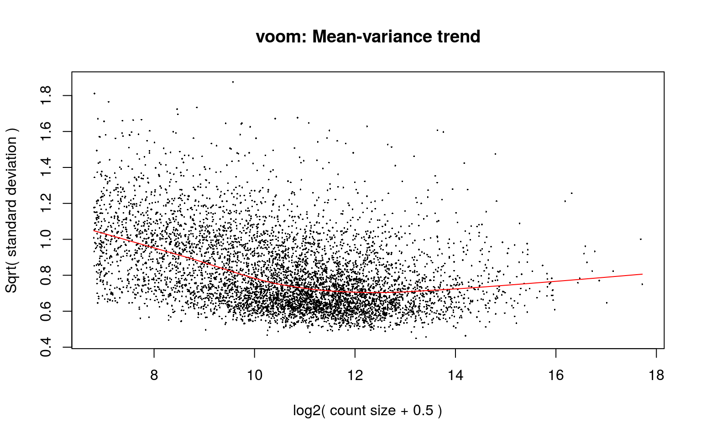
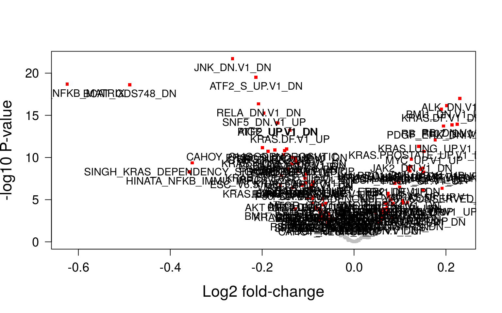

---
output:
  BiocStyle::html_document
---


# Gene Ontology analysis

We will start with a Gene Onthology analysis of the DE genes. The first step is safe the identifiers of the of the original set of gene profiled. Then we will follow the main steps of the GO analysis. This steps are: 1) build a parameter object with information specifying the gene universe, the set of DE genes, the annotation package to use, and so one, 2) run the functional enrichment analysis, and 3) store and visualize the results.


```r
geneUniverse <- rownames(se.filt)
length(geneUniverse)
```

```
[1] 11866
```


```r
library(GOstats)
params <- new("GOHyperGParams", geneIds=DEgenes, universeGeneIds=geneUniverse,
            annotation="org.Hs.eg.db", ontology="BP",
            pvalueCutoff=0.05, testDirection="over")
```

Since a problem in a GO analysis is that the hierarchy of GO terms and their overlap render highly dependent tests. A conditional test is directly used. Then, if parent and child GO term contain the same significant genes, the child node will be retrieved because it is more specific. The no-conditional test is also done to allow the comparison between the two test results. 

```r
hgOver <- hyperGTest(params)
hgOver
```

```
Gene to GO BP  test for over-representation 
13342 GO BP ids tested (136 have p < 0.05)
Selected gene set size: 7794 
    Gene universe size: 9460 
    Annotation package: org.Hs.eg 
```

```r
conditional(params) <- TRUE
hgOverCond <- hyperGTest(params)
hgOverCond
```

```
Gene to GO BP Conditional test for over-representation 
13342 GO BP ids tested (85 have p < 0.05)
Selected gene set size: 7794 
    Gene universe size: 9460 
    Annotation package: org.Hs.eg 
```
As spected we have less significant GO terms when conditional test is used than when we perform a non-conditional test. The number of significant GO terms have chenged from 136 to 85. 

This is the data.frame object with the results:

```r
goresults <- summary(hgOverCond)
head(goresults)
```

```
      GOBPID      Pvalue OddsRatio  ExpCount Count Size
1 GO:0045844 0.001653831       Inf  27.18837    33   33
2 GO:0051153 0.004324410       Inf  23.06004    28   28
3 GO:0055013 0.005309072       Inf  22.24503    27   27
4 GO:0043038 0.007830366       Inf  20.59725    25   25
5 GO:0010501 0.008055666  7.510633  29.66004    35   36
6 GO:0007507 0.008726619  1.588209 205.87924   220  250
                                                       Term
1 positive regulation of striated muscle tissue development
2        regulation of striated muscle cell differentiation
3                           cardiac muscle cell development
4                                     amino acid activation
5                         RNA secondary structure unwinding
6                                         heart development
```

GO terms involving a few genes (e.g., < 3) in their size (m) and in their enrichment by DE genes (k) are likely to be less reliable than those that involve many genes. Likewise, large GO terms may provide little insight. To try to spot the more interesting and reliable GO terms we can filter the previous results by a minimum value on the Count and Size columns, a maximum Count value, and order them by the OddsRatio column:

```r
goresults <- goresults[goresults$Size >= 3 & goresults$Size <= 300 & goresults$Count >= 3, ]
goresults <- goresults[order(goresults$OddsRatio, decreasing=TRUE), ]
head(goresults)
```

```
       GOBPID      Pvalue OddsRatio ExpCount Count Size
1  GO:0045844 0.001653831       Inf 27.18837    33   33
2  GO:0051153 0.004324410       Inf 23.06004    28   28
3  GO:0055013 0.005309072       Inf 22.24503    27   27
4  GO:0043038 0.007830366       Inf 20.59725    25   25
9  GO:0006418 0.011547980       Inf 18.94947    23   23
12 GO:0010591 0.014023396       Inf 18.12558    22   22
                                                        Term
1  positive regulation of striated muscle tissue development
2         regulation of striated muscle cell differentiation
3                            cardiac muscle cell development
4                                      amino acid activation
9                tRNA aminoacylation for protein translation
12                      regulation of lamellipodium assembly
```

# Gene Set Enrichment Analysis (GSEA)
In this case a method for pathway analysis that addresses this shortcoming by assessing DE directly at gene set level is used. Therfore, small but consistent changes occurring for a number of genes operating in a common pathway will be found. To perform this it is calculated for each gene set an enrichment score (ES) as function of the changes in gene expression by the genes forming the gene set.

The used gene set collection has been downloaded from GSEA. It is configured of gene sets that represent signatures of cellular pathways which are often disregulated in cancer.


```
GeneSetCollection
  names: GLI1_UP.V1_DN, GLI1_UP.V1_UP, ..., LEF1_UP.V1_UP (189 total)
  unique identifiers: 22818, 143384, ..., 79649 (11250 total)
  types in collection:
    geneIdType: EntrezIdentifier (1 total)
    collectionType: NullCollection (1 total)
```

```
[1] 189
```

```
[1] "GLI1_UP.V1_DN" "GLI1_UP.V1_UP" "E2F1_UP.V1_DN" "E2F1_UP.V1_UP"
[5] "EGFR_UP.V1_DN" "EGFR_UP.V1_UP"
```

First we need to map the identifiers from the gene sets to the identifiers of the data we are going to analyze:

```r
gsc <- mapIdentifiers(entrezOncogens, AnnoOrEntrezIdentifier(metadata(se.filt)$annotation))
gsc
```

```
GeneSetCollection
  names: GLI1_UP.V1_DN, GLI1_UP.V1_UP, ..., LEF1_UP.V1_UP (189 total)
  unique identifiers: 22818, 143384, ..., 79649 (11250 total)
  types in collection:
    geneIdType: EntrezIdentifier (1 total)
    collectionType: NullCollection (1 total)
```

Nothing has happend, we can jump this step because data is already anchorated to Entrez ientifiers. Then, we have to start with an incidence matrix indicating what genes belong to what gene set:

```r
Im <- incidence(gsc)
dim(Im)
```

```
[1]   189 11250
```

```r
Im[1:2, 1:10]
```

```
              22818 143384 140711 57583 81669 54432 79712 23596 91543 6580
GLI1_UP.V1_DN     1      1      1     1     1     1     1     1     1    1
GLI1_UP.V1_UP     0      0      0     0     0     0     0     0     0    0
```

Next, we discard genes (columns in Im) that do not form part of our data:

```r
Im <- Im[, colnames(Im) %in% rownames(se.filt)]
dim(Im)
```

```
[1]  189 6067
```

Likewise, not all genes in our data are annotated to gene sets, so we also discard them:

```r
se.filt <- se.filt[colnames(Im), ]
dim(se.filt)
```

```
[1] 6067   94
```

```r
dge.filt <- dge.filt[colnames(Im), ]
dim(dge.filt)
```

```
[1] 6067   94
```

<div class="figure" style="text-align: center">

<p class="caption">(\#fig:voomenrichment)Voom plot</p>
</div>

```
[1]  189 6067
```

```
[1] 6067
```

```
[1]  5.547354  7.512204  5.549996 -8.950190 -7.892440  7.462655
```

```
[1] 189
```

```
GLI1_UP.V1_DN GLI1_UP.V1_UP E2F1_UP.V1_DN E2F1_UP.V1_UP EGFR_UP.V1_DN 
     2.918573     -2.710980     -6.409755     -3.131997      1.162975 
EGFR_UP.V1_UP 
    -2.551358 
```

```
   JNK_DN.V1_DN ATF2_S_UP.V1_DN   SNF5_DN.V1_UP    ALK_DN.V1_DN 
       22.04500        20.28736        19.57452        18.89280 
 BCAT_GDS748_DN   KRAS.DF.V1_DN 
       18.48136        17.94397 
```

# Gene Set Variation Analysis (GSVA)


```r
library(GSVA)
GSexpr <- gsva(assays(se.filt)$logCPM, gsc, min.sz=5, max.sz=300, verbose=FALSE)
class(GSexpr)
```

```
[1] "matrix"
```

```r
dim(GSexpr)
```

```
[1] 189  94
```


```r
mod <- model.matrix(~se.filt$type + bcr_patient_barcode, data = colData(se.filt))

fit <- lmFit(GSexpr, mod)
fit <- eBayes(fit)
tt <- topTable(fit, coef = 2, n = Inf)
DEgs <- rownames(tt[tt$adj.P.Val < 0.01, , drop = FALSE])
length(DEgs)
```

```
[1] 108
```


##GSVA volcano plot

<div class="figure" style="text-align: center">

<p class="caption">(\#fig:volcanoGSVA)GSVA volcano plot</p>
</div>


```r
sessionInfo()
```

```
R version 3.4.4 (2018-03-15)
Platform: x86_64-pc-linux-gnu (64-bit)
Running under: Ubuntu 16.04.3 LTS

Matrix products: default
BLAS: /usr/lib/libblas/libblas.so.3.6.0
LAPACK: /usr/lib/lapack/liblapack.so.3.6.0

locale:
 [1] LC_CTYPE=ca_ES.UTF-8       LC_NUMERIC=C              
 [3] LC_TIME=ca_ES.UTF-8        LC_COLLATE=ca_ES.UTF-8    
 [5] LC_MONETARY=ca_ES.UTF-8    LC_MESSAGES=ca_ES.UTF-8   
 [7] LC_PAPER=ca_ES.UTF-8       LC_NAME=C                 
 [9] LC_ADDRESS=C               LC_TELEPHONE=C            
[11] LC_MEASUREMENT=ca_ES.UTF-8 LC_IDENTIFICATION=C       

attached base packages:
[1] parallel  stats4    methods   stats     graphics  grDevices utils    
[8] datasets  base     

other attached packages:
 [1] GO.db_3.5.0                GOstats_2.44.0            
 [3] Category_2.44.0            Matrix_1.2-14             
 [5] GSVA_1.26.0                org.Hs.eg.db_3.5.0        
 [7] GSEABase_1.40.1            graph_1.56.0              
 [9] sva_3.26.0                 BiocParallel_1.12.0       
[11] genefilter_1.60.0          mgcv_1.8-23               
[13] nlme_3.1-137               geneplotter_1.56.0        
[15] annotate_1.56.2            XML_3.98-1.11             
[17] AnnotationDbi_1.40.0       lattice_0.20-35           
[19] edgeR_3.20.9               limma_3.34.9              
[21] SummarizedExperiment_1.8.1 DelayedArray_0.4.1        
[23] matrixStats_0.53.1         Biobase_2.38.0            
[25] GenomicRanges_1.30.3       GenomeInfoDb_1.14.0       
[27] IRanges_2.12.0             S4Vectors_0.16.0          
[29] BiocGenerics_0.24.0        knitr_1.20                
[31] BiocStyle_2.6.1           

loaded via a namespace (and not attached):
 [1] Rcpp_0.12.17           locfit_1.5-9.1         rprojroot_1.3-2       
 [4] digest_0.6.15          mime_0.5               R6_2.2.2              
 [7] backports_1.1.2        RSQLite_2.1.0          evaluate_0.10.1       
[10] highr_0.6              zlibbioc_1.24.0        Rgraphviz_2.22.0      
[13] blob_1.1.1             rmarkdown_1.9          shinythemes_1.1.1     
[16] splines_3.4.4          stringr_1.3.1          RCurl_1.95-4.10       
[19] bit_1.1-14             shiny_1.1.0            compiler_3.4.4        
[22] httpuv_1.4.3           xfun_0.1               pkgconfig_2.0.1       
[25] htmltools_0.3.6        GenomeInfoDbData_1.0.0 bookdown_0.7          
[28] codetools_0.2-15       AnnotationForge_1.20.0 later_0.7.2           
[31] bitops_1.0-6           grid_3.4.4             RBGL_1.54.0           
[34] xtable_1.8-2           DBI_1.0.0              magrittr_1.5          
[37] stringi_1.2.2          XVector_0.18.0         promises_1.0.1        
[40] RColorBrewer_1.1-2     tools_3.4.4            bit64_0.9-7           
[43] survival_2.42-3        yaml_2.1.19            memoise_1.1.0         
```


