---
output:
  BiocStyle::html_document
---


# Data import

We start importing the table of counts from the SummarizedExperiment container that is already paired for the previous filtering process. The structure is the same: the rows represent genes and the columns represent samples. 


```r
library(SummarizedExperiment)

paired_se <- readRDS(file.path("results", "paired_seLUSC.rds"))
paired_se
```

```
class: RangedSummarizedExperiment 
dim: 20115 94 
metadata(5): experimentData annotation cancerTypeCode
  cancerTypeDescription objectCreationDate
assays(1): counts
rownames(20115): 1 2 ... 102724473 103091865
rowData names(3): symbol txlen txgc
colnames(94): TCGA.22.4593.01A.21R.1820.07
  TCGA.22.4609.01A.21R.2125.07 ... TCGA.90.7767.11A.01R.2125.07
  TCGA.92.7340.11A.01R.2045.07
colData names(549): type bcr_patient_uuid ...
  lymph_nodes_aortic_pos_by_ihc lymph_nodes_aortic_pos_total
```

The row table of counts contains RNA-seq data from 20115 genes and 94 samples, which come from 47 patients.

We explore the column, that corresponds to samples. It contains the phenotypic data, which in this case corresponds to clinical variables, and their corresponding metadata. 


```r
dim(colData(paired_se))
```

```
[1]  94 549
```

```r
colData(paired_se)[1:5, 1:5]
```

```
DataFrame with 5 rows and 5 columns
                                 type                     bcr_patient_uuid
                             <factor>                             <factor>
TCGA.22.4593.01A.21R.1820.07    tumor 8fbe1f9e-f2a6-4550-aabf-b06607b821f0
TCGA.22.4609.01A.21R.2125.07    tumor 47cbb242-a356-43ba-95c3-0b0c9ef90fbf
TCGA.22.5471.01A.01R.1635.07    tumor bece6b8e-5d6c-4dd6-85a3-9b3a9c670aa7
TCGA.22.5472.01A.01R.1635.07    tumor bd3bf142-7c14-4538-8a76-3c6e140fa01a
TCGA.22.5478.01A.01R.1635.07    tumor 4daf4a91-bc36-40c8-8fca-ea61b6706775
                             bcr_patient_barcode form_completion_date
                                        <factor>             <factor>
TCGA.22.4593.01A.21R.1820.07        TCGA-22-4593             2011-8-5
TCGA.22.4609.01A.21R.2125.07        TCGA-22-4609            2012-1-16
TCGA.22.5471.01A.01R.1635.07        TCGA-22-5471             2011-5-5
TCGA.22.5472.01A.01R.1635.07        TCGA-22-5472            2011-4-29
TCGA.22.5478.01A.01R.1635.07        TCGA-22-5478             2011-5-5
                             prospective_collection
                                           <factor>
TCGA.22.4593.01A.21R.1820.07                     NO
TCGA.22.4609.01A.21R.2125.07                     NO
TCGA.22.5471.01A.01R.1635.07                     NO
TCGA.22.5472.01A.01R.1635.07                     NO
TCGA.22.5478.01A.01R.1635.07                     NO
```

```r
mcols(colData(paired_se), use.names=TRUE)
```

```
DataFrame with 549 rows and 2 columns
                                                         labelDescription
                                                              <character>
type                                           sample type (tumor/normal)
bcr_patient_uuid                                         bcr patient uuid
bcr_patient_barcode                                   bcr patient barcode
form_completion_date                                 form completion date
prospective_collection            tissue prospective collection indicator
...                                                                   ...
lymph_nodes_pelvic_pos_total                               total pelv lnp
lymph_nodes_aortic_examined_count                           total aor lnr
lymph_nodes_aortic_pos_by_he                          aln pos light micro
lymph_nodes_aortic_pos_by_ihc                                 aln pos ihc
lymph_nodes_aortic_pos_total                                total aor-lnp
                                        CDEID
                                  <character>
type                                       NA
bcr_patient_uuid                           NA
bcr_patient_barcode                   2673794
form_completion_date                       NA
prospective_collection                3088492
...                                       ...
lymph_nodes_pelvic_pos_total          3151828
lymph_nodes_aortic_examined_count     3104460
lymph_nodes_aortic_pos_by_he          3151832
lymph_nodes_aortic_pos_by_ihc         3151831
lymph_nodes_aortic_pos_total          3151827
```

These metadata consists of two columns of information about the clinical variables. One called `labelDescription` contains a succint description of the variable, often not more self-explanatory than the variable name itself, and the other called 'CDEID' corresponds to the `Common Data Element (CDE)` identifier. This identifier can be useed to search for further information about the associated clinical variable.

Now, we explore the row (feature) data.


```r
rowData(paired_se)
```

```
DataFrame with 20115 rows and 3 columns
           symbol     txlen      txgc
      <character> <integer> <numeric>
1            A1BG      3322 0.5644190
2             A2M      4844 0.4882329
3            NAT1      2280 0.3942982
4            NAT2      1322 0.3895613
5        SERPINA3      3067 0.5249429
...           ...       ...       ...
20111       POTEB      1706 0.4308324
20112    SNORD124       104 0.4903846
20113   SNORD121B        81 0.4074074
20114      GAGE10       538 0.5055762
20115   BRWD1-IT2      1028 0.5924125
```

```r
rowRanges(paired_se)
```

```
GRanges object with 20115 ranges and 3 metadata columns:
            seqnames               ranges strand |      symbol     txlen
               <Rle>            <IRanges>  <Rle> | <character> <integer>
          1    chr19 [58345178, 58362751]      - |        A1BG      3322
          2    chr12 [ 9067664,  9116229]      - |         A2M      4844
          9     chr8 [18170477, 18223689]      + |        NAT1      2280
         10     chr8 [18391245, 18401218]      + |        NAT2      1322
         12    chr14 [94592058, 94624646]      + |    SERPINA3      3067
        ...      ...                  ...    ... .         ...       ...
  100996331    chr15 [20835372, 21877298]      - |       POTEB      1706
  101340251    chr17 [40027542, 40027645]      - |    SNORD124       104
  101340252     chr9 [33934296, 33934376]      - |   SNORD121B        81
  102724473     chrX [49303669, 49319844]      + |      GAGE10       538
  103091865    chr21 [39313935, 39314962]      + |   BRWD1-IT2      1028
                 txgc
            <numeric>
          1 0.5644190
          2 0.4882329
          9 0.3942982
         10 0.3895613
         12 0.5249429
        ...       ...
  100996331 0.4308324
  101340251 0.4903846
  101340252 0.4074074
  102724473 0.5055762
  103091865 0.5924125
  -------
  seqinfo: 455 sequences (1 circular) from hg38 genome
```

We are going to compare normal samples with tumor samples. Exploring the metadata, we can see that we have 47 normal samples and 47 tumor samples. As they are paired, the number must be the same.


```r
table(paired_se$type)
```

```

normal  tumor 
    47     47 
```

# Quality assessment

Normalitzation consists in the adjustment for sample and gene specific factors, to make gene expression values comparable across samples. This process is really important due to the fact that the samples may have been sequenced at different depth and that there may be sample specific biases related to technical differences in samples extarction, preparation and sequencing. 

The normalitzation is done in two steps: 
* Within-sample: adjustments to compare across features in a sample.
  *Scaling: using counts per million reads (CPM) mapped to the genome.
*Between-sample: adjustments to compare a feature across samples.
  *Sample-specific normalization factors: using the TMM algorithm from the R/Bioconductor package edgeR.
  *Quantile normalization: using the CQN algorithm from the R/Bioconductor package cqn or in the limma-voom pipeline.

To perform quality assessment and normalization we need first to load the [edgeR](http://bioconductor.org/packages/edgeR) R/Bioconductor package and create a `DGEList` object.


```r
library(edgeR)

paired_dge <- DGEList(counts=assays(paired_se)$counts, genes=mcols(paired_se))
```

```
Warning in as.data.frame(x, row.names = NULL, optional = optional, ...):
Arguments in '...' ignored
```

```r
names(paired_dge)
```

```
[1] "counts"  "samples" "genes"  
```

```r
saveRDS(paired_dge, file.path("results", "paired_dge.rds"))
```

Once the 'DGEList' object is created, we can performe the scaling to CPM values. Therefore, $\log_2$ CPM values of expression are calculated and used as an additional assay element to ease their manipulation. $\log_2$ CPM units separate better high and low expression, than raw counts or non-logged CPM units.


```r
assays(paired_se)$logCPM <- cpm(paired_dge, log=TRUE, prior.count=0.5)
assays(paired_se)$logCPM[1:5, 1:5]
```

```
   TCGA.22.4593.01A.21R.1820.07 TCGA.22.4609.01A.21R.2125.07
1                      2.433074                     1.760274
2                      9.013463                    10.810625
9                     -6.857108                    -6.857108
10                    -6.857108                    -6.857108
12                     5.605901                     5.647349
   TCGA.22.5471.01A.01R.1635.07 TCGA.22.5472.01A.01R.1635.07
1                      2.122585                    0.7750831
2                      7.713748                   11.1007352
9                     -6.857108                   -6.8571079
10                    -6.857108                   -6.8571079
12                     4.823934                    5.8569327
   TCGA.22.5478.01A.01R.1635.07
1                      3.713818
2                      9.448173
9                     -6.857108
10                    -6.857108
12                     4.920808
```

## Sequencing depth

Let's examine the sequencing depth in terms of total number of sequence read counts
mapped to the genome per sample. Figure \@ref(fig:libsizes) below shows the
sequencing depth per sample, also known as library sizes, in increasing order.

<!---
you can control the height and width in pixels of the figure with 'out.height' and
'out.width'. Figures are automatically numbered, to refer to them in the main test
you should use the notation shown above as \@ref(fig:xxxx) with xxxx being the label
in the code chunk that also gives the filename of the figure. This name must be unique
--->

<div class="figure" style="text-align: center">
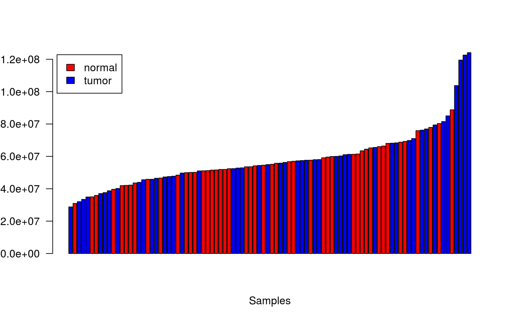
<p class="caption">(\#fig:libsizes)Library sizes in increasing order.</p>
</div>

There is the same number of tumor samples and normal samples and they seem to be randonly distributed. However, there is still high variability in the library size as can be observed in Figure \@ref(fig:libsizes).

## Distribution of expression levels among samples

Let's look at the distribution of expression values per sample in terms of logarithmic CPM units. Due to the large number of samples, we display tumor and normal samples separately, and are shown in Figure \@ref(fig:distRawExp)

<div class="figure" style="text-align: center">
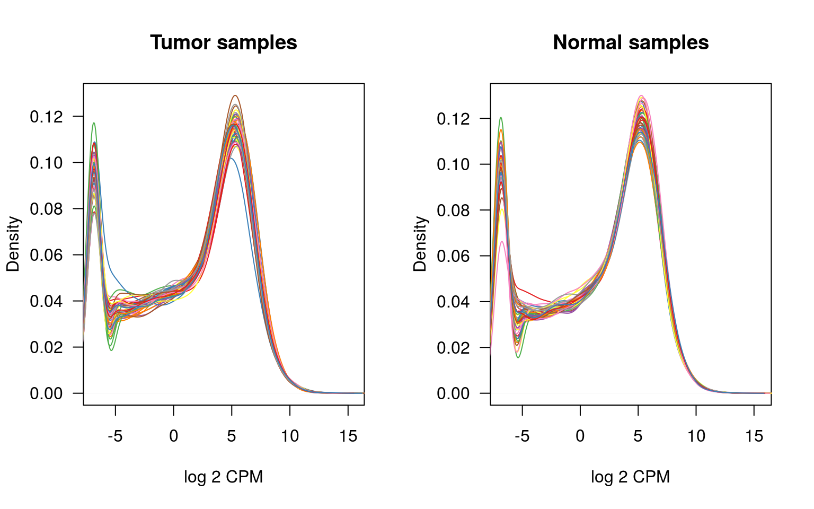
<p class="caption">(\#fig:distRawExp)Non-parametric density distribution of expression profiles per sample.</p>
</div>

In Figure \@ref(fig:distRawExp) we do not appreciate substantial differences between the samples in the distribution of expression values as.


## Distribution of expression levels among genes

Let's calculate now the average expression per gene through all the samples. Figure \@ref(fig:exprdist) shows the distribution of those values across genes.

<div class="figure" style="text-align: center">
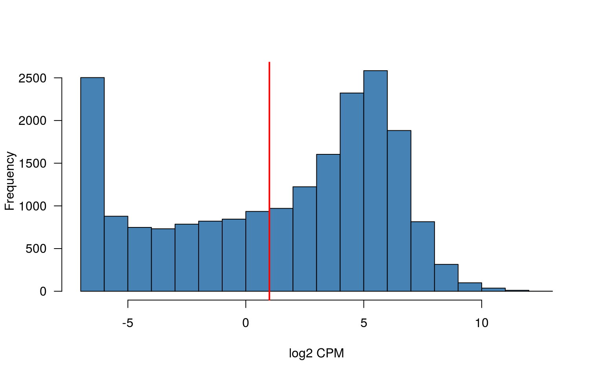
<p class="caption">(\#fig:exprdist)Distribution of average expression level per gene.</p>
</div>

RNA-seq expression profiles from lowly-expressed genes can lead to artifacts in downstream differential expression analyses. For this reason, it is common practice to remove them following some criteria, such as: filter out genes below a minimum average CPM (or log2 CPM) value throughout the samples or filter out genes with fewer than a given number of samples meeting a minimum CPM (or log2 CPM) cutoff. This graphic shows what would be the minimum average CPM (red line).


We can also make an MA-plot to see biases due to expression. First, we define the groups that we want to compare. In our case, we use the sample type to define groups, by modifying the DGEList object as follows:


```r
paired_dge$samples$group <- paired_se$type
table(paired_dge$samples$group)
```

```

normal  tumor 
    47     47 
```

Here we generate the MA-plot using type sample as grouping factor. 

<div class="figure" style="text-align: center">
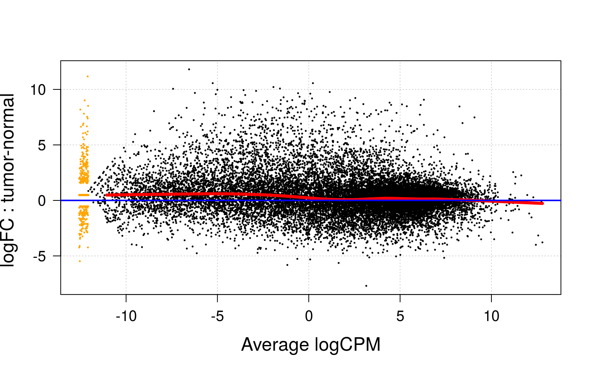
<p class="caption">(\#fig:smear1)MA-plot using type grouping.</p>
</div>

Figure \@ref(fig:smear1) shows us the need of remove the lower experssed genes to normalize the samples.


## Filtering of lowly-expressed genes

In the light of this plot, we may consider a cutoff of 1 log CPM unit as minimum value of expression to select genes being expressed across samples. Using this cutoff we proceed to filter out lowly-expressed genes.


```r
mask <- avgexp > 1
dim(paired_se)
```

```
[1] 20115    94
```

```r
paired_se.filt <- paired_se[mask, ]
dim(paired_se.filt)
```

```
[1] 11866    94
```

```r
paired_dge.filt <- paired_dge[mask, ]
dim(paired_dge.filt)
```

```
[1] 11866    94
```

After this filtering process, we end up with 11866 genes.

Store un-normalized versions of the filtered expression data.


```r
saveRDS(paired_se.filt, file.path("results", "paired_se.filt.unnorm.rds"))
saveRDS(paired_dge.filt, file.path("results", "paired_dge.filt.unnorm.rds"))
```

We can also use a second approach to filter data using the CPM cutoff value of expression. We will keep only genes that have this minimum level of expression in at least as many samples as the smallest group of comparison. We are still comparing sample type. 


```r
cpmcutoff <- round(10/min(paired_dge$sample$lib.size/1e+06), digits = 1)
cpmcutoff
```

```
[1] 0.3
```

```r
nsamplescutoff <- min(table(paired_se$type))
nsamplescutoff
```

```
[1] 47
```

After knowing these parameters we can proceed to mask the lower-expressed genes. 


```r
mask2 <- rowSums(cpm(paired_dge) > cpmcutoff) >= nsamplescutoff
paired_se.filt2 <- paired_se[mask2, ]
paired_dge.filt2 <- paired_dge[mask2, ]
dim(paired_se)
```

```
[1] 20115    94
```

```r
dim(paired_se.filt)
```

```
[1] 11866    94
```

```r
dim(paired_se.filt2)
```

```
[1] 14200    94
```

After this second kind of filtering, we end up with 14200. As we can see, the first filter is more stringent thant the second one.

Store un-normalized versions of the filtered expression data.


```r
saveRDS(paired_se.filt2, file.path("results", "paired_se.filt2.unnorm.rds"))
saveRDS(paired_dge.filt2, file.path("results", "paired_dge.filt2.unnorm.rds"))
```

We will compare both approaches done before in order to compare them and see which one discards more genes and is more restrictive.

<div class="figure" style="text-align: center">
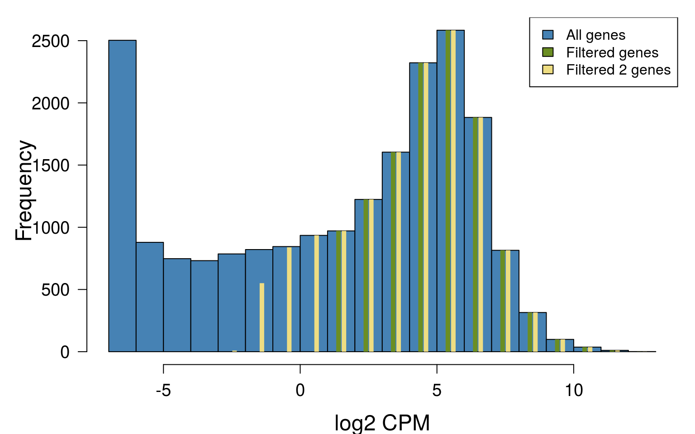
<p class="caption">(\#fig:exprdist2)Distribution of average expression level per gene and filtering comparative.</p>
</div>

After comparing the different approaches used in the filter of low expressed genes, we have decided to contunue working with the first set of filtered genes because this is more restrictive. We can see in Figure \@ref(fig:exprdist2) that the second approach is more conservative with our dataset and even genes with negative logCPM passes through this filter. 


## Normalization

We calculate now the normalization factors on the filtered expression data set.


```r
paired_dge.filt <- calcNormFactors(paired_dge.filt)
```

Replace the raw log2 CPM units in the corresponding assay element of the `SummarizedExperiment`
object, by the normalized ones.


```r
assays(paired_se.filt)$logCPM <- cpm(paired_dge.filt, log=TRUE, normalized.lib.sizes=TRUE, prior.count=0.25)
```

Store normalized versions of the filtered expression data.


```r
saveRDS(paired_se.filt, file.path("results", "paired_se.filt.rds"))
saveRDS(paired_dge.filt, file.path("results", "paired_dge.filt.rds"))
```


## MA-plots

We examine now the MA-plots of the normalized expression profiles. We look first to the tumor samples in Figure \@ref(fig:maPlotsTumor).

<!---
Here we make a MA-plot for each sample. The options 'fig.height' and 'fig.width'
control the relative image size in *inches*. The final image size results from
'height'x'dpi' and 'width'x'dpi', where 'dpi' is the image resolution in
"dots per inch" (by default dpi=72). To scale the image to a desired size use
'out.width' and 'out.height'. More information at http://yihui.name/knitr/options
--->

First, we define the groups that we want to compare. In our case, we use the sample type to define groups, by modifying the DGEList object as follows:


```r
paired_dge$samples$group <- paired_se$type
table(paired_dge$samples$group)
```

```

normal  tumor 
    47     47 
```

```r
paired_dge.filt$samples$group <- paired_se$type
```

Here we generate the MA-plot using type sample as grouping factor. 

<div class="figure" style="text-align: center">
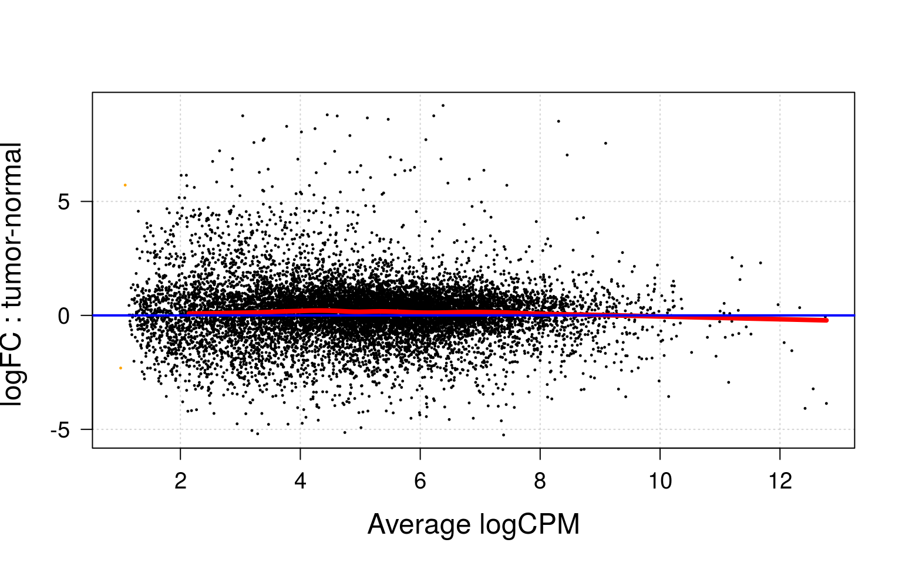
<p class="caption">(\#fig:smear2)MA-plot using type grouping after filtering by low expression.</p>
</div>

In Figure \@ref(fig:smear2) we don't see the artifact caused by the discreteness of counts at low values, where ratios between low numbers may easy lead to large fold-changes. In general, fold-changes from large expression values are more reliable than those coming from low-expression values. We don't see it because we have filtered by low-expression previously. Red line, which indicates us the tendency of the dots, shows that there is no bias, since it falls in the blue line. At the end it seems to decrease a little, but as we said, the fold-changes with a high average logCPM is more reliable. The problem would be if the biased was at the beginning. 

<div class="figure" style="text-align: center">
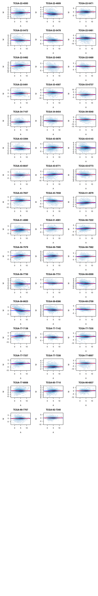
<p class="caption">(\#fig:maPlotsTumor)MA-plots of the tumor samples.</p>
</div>

We do not observe samples with major expression-level dependent biases. Although some individual samples may have little bias, in general this is corrected. Let's look now to the normal samples in Figure \@ref(fig:maPlotsNormal).

<div class="figure" style="text-align: center">
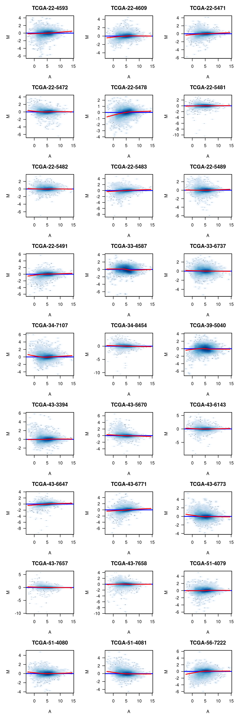
<p class="caption">(\#fig:maPlotsNormal)MA-plots of the normal samples.</p>
</div><div class="figure" style="text-align: center">
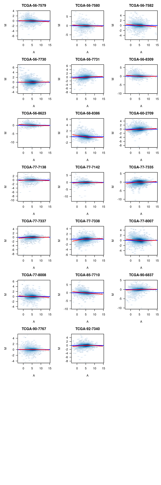
<p class="caption">(\#fig:maPlotsNormal)MA-plots of the normal samples.</p>
</div>

We do not observe neither important expression-level dependent biases among the normal samples in Figure \@ref(fig:maPlotsNormal). There is even less bias than in tumor samples.

## Batch identification

We will search now for potential surrogate of batch effect indicators. Given that each sample names corresponds to a TCGA barcode (see https://wiki.nci.nih.gov/display/TCGA/TCGA+barcode), following the strategy described in http://bioinformatics.mdanderson.org/main/TCGABatchEffects:Overview we are going to derive different elements of the TCGA barcode and examine their distribution across samples.


```r
tss <- substr(colnames(paired_se.filt), 6, 7)
table(tss)
```

```
tss
22 33 34 39 43 51 56 58 60 77 85 90 92 
20  4  4  2 16  6 16  2  2 14  2  4  2 
```

```r
center <- substr(colnames(paired_se.filt), 27, 28)
table(center)
```

```
center
07 
94 
```

```r
plate <- substr(colnames(paired_se.filt), 22, 25)
table(plate)
```

```
plate
0980 1100 1635 1758 1820 1858 1949 2045 2125 2187 2296 2326 A28V 
   1    3   11    4   14    1    8   20   20    4    4    2    2 
```

```r
portionanalyte <- substr(colnames(paired_se.filt), 18, 20)
table(portionanalyte)
```

```
portionanalyte
01R 11R 21R 31R 41R 
 55  27   8   2   2 
```

```r
samplevial <- substr(colnames(paired_se.filt), 14, 16)
table(samplevial)
```

```
samplevial
01A 11A 
 47  47 
```

From this information we can make the following observations:

  * All samples were sequenced at the same center

  * Samples belong to two vials.

  * Samples were collected across different tissue source sites (TSS).

  * Samples were sequenced within differnt plates. There are 13 different plates.

  * Samples were sequenced using different portions and analyte combinations. There are 5 different conditions described. 
  

We are going to use the TSS as surrogate of batch effect indicator. Considering our outcome
of interest as molecular changes between sample types, tumor vs. normal, we will examine now
the cross-classification of this outcome with TSS.


```r
table(data.frame(TYPE=paired_se.filt$type, TSS=tss))
```

```
        TSS
TYPE     22 33 34 39 43 51 56 58 60 77 85 90 92
  normal 10  2  2  1  8  3  8  1  1  7  1  2  1
  tumor  10  2  2  1  8  3  8  1  1  7  1  2  1
```

We observe that we have the same TSS in normal and tumor samples, so the TSS is not a source of variability, since they are all the same.

We can also examine the other three parameters that can lead to variability due to technical issues. We are not interested in this variability and can be a source of confussion.


```r
table(data.frame(TYPE=paired_se.filt$type, PORTIONALYTE=portionanalyte))
```

```
        PORTIONALYTE
TYPE     01R 11R 21R 31R 41R
  normal  44   3   0   0   0
  tumor   11  24   8   2   2
```

```r
table(data.frame(TYPE=paired_se.filt$type, PLATE=plate))
```

```
        PLATE
TYPE     0980 1100 1635 1758 1820 1858 1949 2045 2125 2187 2296 2326 A28V
  normal    0    0    5    4    7    1    4   10   10    2    2    1    1
  tumor     1    3    6    0    7    0    4   10   10    2    2    1    1
```

```r
table(data.frame(TYPE=paired_se.filt$type, SAMPLEVIAL=samplevial))
```

```
        SAMPLEVIAL
TYPE     01A 11A
  normal   0  47
  tumor   47   0
```

* All normal samples belong to the same vial and all tumor samples belong to the same vial. As it is remarked in the [documentation](https://gdc.cancer.gov/resources-tcga-users/tcga-code-tables/sample-type-codes), this is the correct sample vial for tumoral tissue and for normal tissue. So it does not provoque any variability. Moreover, they are all from the same aliquot (A).

* The plate is almost equal between normal and tumor.

For these reasons, the variables that may lead into batch effects are not leading to it, as commented before.  

To ilustrate how samples are grouped together by hierarchical clustering and multidimensional scaling, we draw the Dendrogram plot (Figure \@ref(fig:sampleClustering1)) and the MDS plot (Figure \@ref(fig:mdsPlot1)). We calculate again log CPM values with a higher prior count to moderate extreme fold-changes produced by low counts.

<div class="figure" style="text-align: center">
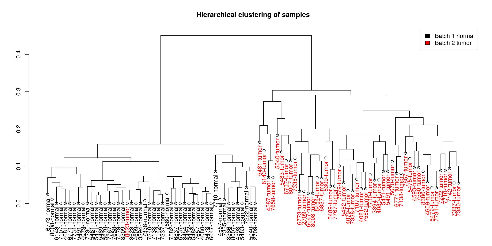
<p class="caption">(\#fig:sampleClustering1)Hierarchical clustering of the samples.</p>
</div>

We can observe that samples cluster primarily by sample type: tumor or normal. 

In Figure \@ref(fig:mdsPlot1) we show the corresponding MDS plot. Here we see more clearly that tumor and normal samples are separated. We can also observe that one tumor samples, corresponding to individual 8623 is in the normal cluster and also happens in the MDS plot. A closer examination of their corresponding MA-plots also reveals a slight dependence of expression changes on average expression. We may consider discarding this sample and doing the MDS plot again to have a closer look to the differences among the rest of the samples.


<div class="figure" style="text-align: center">
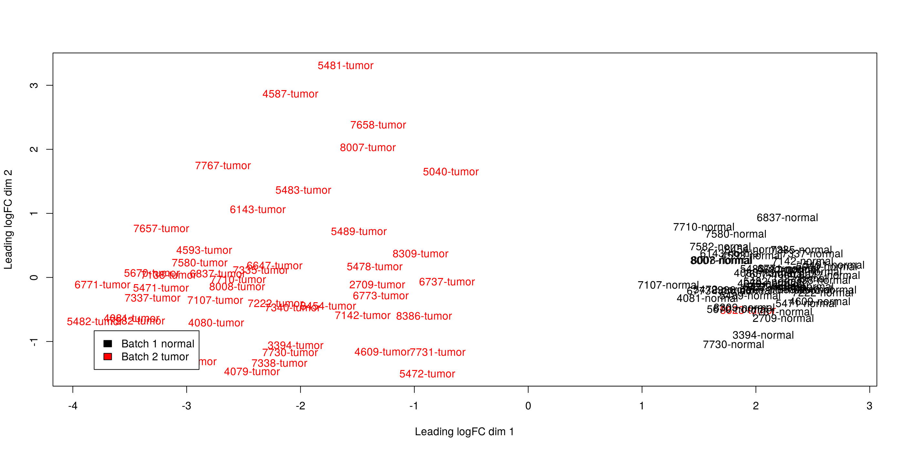
<p class="caption">(\#fig:mdsPlot1)Multidimensional scaling plot of the samples.</p>
</div>

For the former case, assume that from the previous MDS plot we could decide discard that mentioned sample, which is identified with the number 8623. But we will not do it because we have problems with the matrix size after removing this sample.

As we have not eliminate batch effects, because we have decided that there is no significant since the samples are paired and most of the technical variables are compensated or the same, we will keep working with the SummarizedExperiment object from filtered genes.

Here is seen how the sample disapears after it is removed, then all the normal samples and tumor samples cluster together with any exception (Figure \@ref(fig:sampleClustering2) and Figure \@ref(fig:mdsPlot2). 


```r
maskbad <- colnames(paired_se.filt) %in% colnames(paired_se.filt)[substr(colnames(paired_se.filt), 9, 12) == "8623"]
dim(paired_se.filt)
```

```
[1] 11866    94
```

```r
dim(paired_dge.filt)
```

```
[1] 11866    94
```

```r
paired_se.filt <- paired_se.filt[, !maskbad]
paired_dge.filt <- paired_dge.filt[, !maskbad]
dim(paired_se.filt)
```

```
[1] 11866    92
```

```r
dim(paired_dge.filt)
```

```
[1] 11866    92
```

<div class="figure" style="text-align: center">
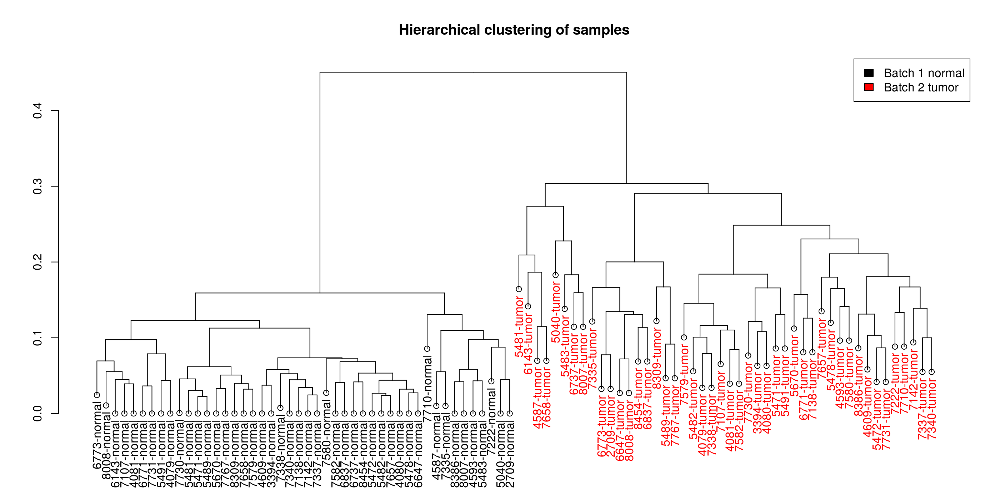
<p class="caption">(\#fig:sampleClustering2)Hierarchical clustering of the samples.</p>
</div>

<div class="figure" style="text-align: center">
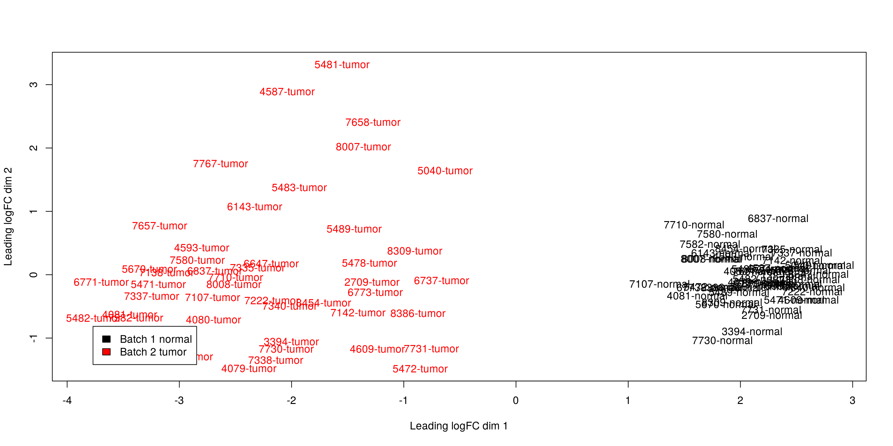
<p class="caption">(\#fig:mdsPlot2)Multidimensional scaling plot of the samples.</p>
</div>


```r
saveRDS(paired_se.filt, file.path("results", "paired_se.filt2.rds"))
saveRDS(paired_dge.filt, file.path("results", "paired_dge.filt2.rds"))
```
